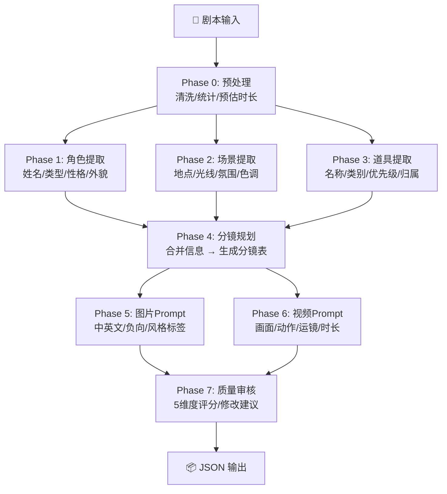

# 🎬 AI 短剧生成流水线

> 纯 Python 实现的多阶段 AI 短剧自动生成工具 —— 从剧本到分镜表 + AI 绘画/视频 Prompt，全链路自动化。

[](https://python.org)
[](LICENSE)
[](#脱机演示模式)

---

## 📖 项目简介

这是一个面向 **AI 短剧/视频内容创作** 的命令行工具。输入一段短剧剧本，自动完成：

```
剧本输入 → 角色提取 → 场景分析 → 道具识别 → 分镜规划 → 图片Prompt → 视频Prompt → 质量审核 → JSON输出
```

**对标岗位**：AI 应用开发工程师（AI 短剧 / Agent 方向）

**核心亮点**：
- 🔥 **8 阶段全链路自动化**：从文本到可生成的分镜方案
- 🔥 **双模型支持**：DeepSeek + 豆包，一键切换
- 🔥 **离线 Demo 模式**：不调 API 也能跑通全流程，内置完整 12 镜头示例
- 🔥 **工程化设计**：LLM 客户端封装、JSON 容错解析、CLI 参数化

---

## 🏗️ 工作流架构



## 🚀 快速开始

### 环境要求

- Python 3.9+
- 可选：DeepSeek 或豆包 API Key（不填也能用 Demo 模式）

### 安装

```bash
# 克隆仓库
git clone https://github.com/Y-w1234/ai-short-drama-pipeline.git
cd ai-short-drama-pipeline

# 安装依赖（只有一个 requests）
pip install -r requirements.txt
```

### 3 种运行方式

```bash
# 1️⃣ 脱机演示（不设置 API Key 即自动使用内置示例数据）
python main.py

# 2️⃣ 使用 DeepSeek API（推荐，注册送免费额度）
set DEEPSEEK_API_KEY=sk-xxxxx
python main.py

# 3️⃣ 指定自己的剧本文件
python main.py --script my_script.txt --output results/my_drama.json
```

### 配置 API Key

```bash
# Windows
set DEEPSEEK_API_KEY=sk-your-key-here

# Linux / macOS
export DEEPSEEK_API_KEY=sk-your-key-here

# 或者直接传参
python main.py --api-key sk-your-key-here
```

> 💡 **没有 API Key？** 用 `--demo` 模式，内置了完整的 12 镜头短剧《服务器宕机了》示例数据，流程完全一样，只是不调真实 API。

---

## 📋 CLI 参数

| 参数 | 说明 | 默认值 |
|------|------|--------|
| `--script` | 剧本文件路径（.txt） | 内置测试剧本 |
| `--model` | LLM 提供商：`deepseek` / `doubao` | `deepseek` |
| `--api-key` | API Key（优先级 > 环境变量） | — |
| `--output` | 输出 JSON 路径 | `output/short_drama_result.json` |

> 💡 **没有 API Key？** 直接运行 `python main.py`，脚本会自动检测并使用内置 Demo 数据。

---

## 📦 输出 JSON 结构

```json
{
  "metadata": {
    "pipeline": "AI Short Drama Pipeline v1.0",
    "model": "deepseek-chat",
    "char_count": 520,
    "estimated_minutes": 2.6
  },
  "characters": {
    "characters": [
      {
        "id": "char_001",
        "name": "张三",
        "type": "主角",
        "gender": "男",
        "age_group": "青年",
        "personality": ["冲动", "正义", "幽默"],
        "appearance": ["短发寸头", "深色连帽卫衣", "左眉浅疤"],
        "first_line": "李总，不好了！服务器宕机了！",
        "relationships": [{"to": "李总", "relation": "上下级"}]
      }
    ],
    "total": 3
  },
  "scenes": {
    "scenes": [
      {
        "id": "scene_001",
        "name": "李总办公室",
        "location_type": "室内",
        "time_of_day": "下午",
        "description": "20平米现代办公室，落地窗朝向CBD...",
        "lighting": "下午暖光从落地窗斜射入室",
        "atmosphere": "紧张",
        "color_tone": "暖色调偏灰",
        "characters_present": ["张三", "李总", "小王"],
        "key_props": ["办公桌", "电脑显示器", "文件堆"]
      }
    ],
    "total": 2
  },
  "props": {
    "props": [
      {
        "id": "prop_001",
        "name": "手机",
        "category": "电子产品",
        "priority": "A",
        "scenes": ["机房"],
        "used_by": ["小王"],
        "description": "黑色智能手机，屏幕上显示猎头发来的消息"
      }
    ],
    "total": 4
  },
  "storyboard": {
    "project": {
      "title": "服务器宕机了",
      "genre": "职场/剧情",
      "estimated_duration": "120秒"
    },
    "storyboard": [
      {
        "shot_id": "shot_001",
        "scene_id": "scene_001",
        "shot_type": "中景",
        "camera_angle": "平视",
        "camera_setup": "过肩视角，从李总身后拍向门口",
        "visual_description": "办公室门被猛地推开，张三气喘吁吁站在门口...",
        "character_actions": {"张三": "推开门冲入，气喘吁吁"},
        "dialogue": "张三：李总，不好了！服务器宕机了！",
        "duration_seconds": 4,
        "camera_movement": "固定",
        "transition": "硬切",
        "mood": "紧张"
      }
    ]
  },
  "image_prompts": {
    "prompts": [
      {
        "shot_id": "shot_001",
        "prompt_cn": "影视级现实主义，电影质感...",
        "prompt_en": "cinematic photorealistic, 8k...",
        "negative_prompt": "blur, deformed, extra fingers...",
        "style_tags": ["cinematic", "photorealistic"],
        "aspect_ratio": "16:9"
      }
    ]
  },
  "video_prompts": {
    "video_prompts": [
      {
        "shot_id": "shot_001",
        "prompt": "cinematic video, smooth camera movement...",
        "motion_description": "自然动作流畅",
        "camera_motion": "固定→微摇",
        "duration_seconds": 4
      }
    ]
  },
  "quality_report": {
    "scores": {
      "narrative_flow": {"score": 5, "reason": "12个分镜叙事流畅"},
      "visual_consistency": {"score": 5, "reason": "角色外观一致"},
      "pacing": {"score": 4, "reason": "节奏张弛有度"},
      "emotional_expression": {"score": 5, "reason": "景别精准"},
      "generatability": {"score": 5, "reason": "Prompt可直接用于生成"}
    },
    "overall_score": 4.8,
    "verdict": "通过",
    "suggestions": []
  }
}
```

---

## 🎯 各阶段详解

| Phase | 节点 | System Prompt 设计要点 | 输出 |
|-------|------|----------------------|------|
| 0 | 预处理 | 清洗注释、统计字符/行数、估算时长 | 结构化元数据 |
| 1 | 角色提取 | 影视分析专家角色设定，9 维度角色画像 | 角色列表 JSON |
| 2 | 场景提取 | 美术指导视角，8 维度空间描述 | 场景列表 JSON |
| 3 | 道具提取 | 道具师视角，A/B/C 三级优先级 | 道具列表 JSON |
| 4 | 分镜规划 | 导演视角，合并前置信息，14 维度分镜 | 分镜表 JSON |
| 5 | 图片 Prompt | [主体]+[场景]+[光线]+[构图]+[风格] 结构 | 中英文 Prompt |
| 6 | 视频 Prompt | 画面+动作+运镜+时长，四要素 | 视频 Prompt |
| 7 | 质量审核 | 5 维度 0-5 评分：叙事/视觉/节奏/情感/可生成性 | 审核报告 |

## 🛠️ 技术栈

| 技术 | 用途 |
|------|------|
| **Python 3.9+** | 主语言 |
| **requests** | HTTP 调用 LLM API |
| **argparse** | CLI 参数解析 |
| **json** | 数据结构化与容错解析 |
| **DeepSeek API** | 主力模型（兼容 OpenAI 格式） |
| **豆包 API** | 备选模型 |

> 📌 **刻意不引入 LangChain 等框架**——这个项目用裸 `requests` 从零实现，目的是展示对 API 调用、Prompt 工程、JSON 容错处理等底层原理的理解。

---

## 📁 项目结构

```
ai-short-drama-pipeline/
├── main.py              # 主程序（569行，单文件完整实现）
├── requirements.txt     # Python 依赖
├── README.md           # 本文件
├── .env.example        # 环境变量模板
├── .gitignore          # Git 忽略规则
└── output/             # 输出目录
    └── short_drama_result.json
```

## 🎭 脱机演示模式

`--demo` 模式内置了一个完整的 12 镜头短剧《**服务器宕机了**》：

- **3 个角色**：张三（主角）、李总（配角）、小王（配角）
- **2 个场景**：李总办公室、机房
- **4 个道具**：手机（A级）、钢笔、耳机、服务器机柜
- **12 个分镜**：从"冲入办公室"到"收到猎头消息，走向门口"
- **质量评分**：4.8/5

故事线：服务器宕机 → 领导发火 → 技术男救场 → 被忽视的不满 → 猎头挖角 → 犹豫后回复"我考虑一下"

## 🔮 后续计划

- [ ] 对接即梦/通义万相 API，实现真正的图片生成
- [ ] 对接即梦/可灵 API，实现视频片段生成
- [ ] Streamlit Web 界面
- [ ] Docker 一键部署
- [ ] 用 LangGraph 重构为可视化工作流

---

## 📄 License

MIT License

---

> 🤖 本项目为 AI 辅助开发作品。架构设计、Prompt 工程、工作流编排由作者主导；代码实现由 Claude Code 辅助生成。
