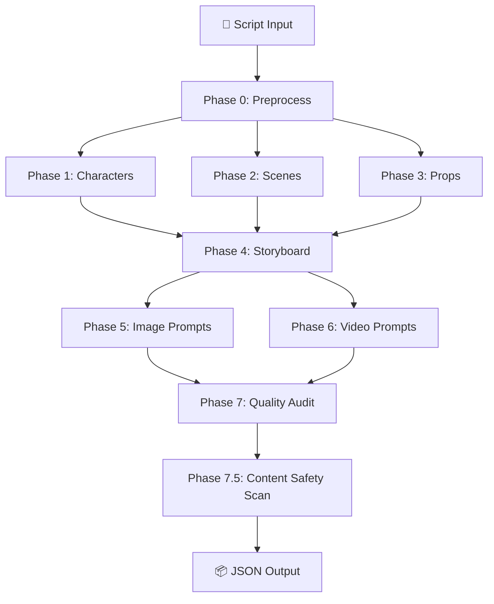

# 🎬 AI Short Drama Pipeline

> A pure-Python multi-stage AI short drama generation tool — from script to storyboard + AI image/video prompts, fully automated.

[](https://python.org)
[](LICENSE)
[](#offline-demo-mode)
[](.github/workflows/test.yml)

---

## 📖 Overview

A CLI tool for **AI-powered short drama/video content creation**. Input a script, get a production-ready JSON output containing character profiles, scene analyses, prop inventories, storyboard breakdowns, AI image-generation prompts, AI video-generation prompts, and a quality assurance report.

**Target role**: AI Application Engineer (AI Short Drama / Agent direction)

**Key features**:
- 🔥 **8-stage full automation**: from raw text → production-ready storyboard solution
- 🔥 **Dual LLM support**: DeepSeek + Doubao (ByteDance), one-flag switch
- 🔥 **Offline Demo mode**: full pipeline without API key — built-in 12-shot "Server Crashed" drama
- 🔥 **Security by Design**: multi-layer defense against prompt injection, path traversal, unsafe content
- 🔥 **Parallel execution**: Phase 1–3 and Phase 5–6 run concurrently via ThreadPoolExecutor
- 🔥 **Few-shot prompting**: all 7 system prompts include JSON examples for format consistency
- 🔥 **Token tracking**: cumulative API usage statistics in output metadata
- 🔥 **Quality gating**: auto-reject results scoring < 3.0/5

---

## 🏗️ Pipeline Architecture

```
Script Input → Phase 0 (Preprocess) → Phase 1-3 (Characters / Scenes / Props — parallel)
            → Phase 4 (Storyboard) → Phase 5-6 (Image + Video Prompts — parallel)
            → Phase 7 (Quality Audit) → Phase 7.5 (Content Safety) → JSON Output
```



---

## 🚀 Quick Start

### Requirements

- Python 3.9+
- Optional: DeepSeek or Doubao API Key (offline demo works without)

### Install

```bash
git clone https://github.com/Y-w1234/ai-short-drama-pipeline.git
cd ai-short-drama-pipeline
pip install -r requirements.txt
```

### 3 Ways to Run

```bash
# 1. Offline demo (no API Key needed)
python main.py

# 2. With DeepSeek API (recommended — free credits on signup)
#    Copy .env.example to .env and add your key
cp .env.example .env
python main.py

# 3. With custom script file
python main.py --script my_script.txt --output results/my_drama.json
```

### Docker

```bash
docker build -t short-drama-pipeline .
docker run --rm short-drama-pipeline
```

---

## 🔒 Security by Design

Defense in Depth — 4 layers of protection:

| Layer | Measures | Implementation |
|-------|----------|---------------|
| **Input** | Prompt injection protection (XML tag isolation + prescan) | `LLMClient.safe_chat()` + `prescan_script()` |
| | Path traversal prevention | `safe_script_path()` + `safe_output_path()` |
| **Processing** | JSON Schema validation (field-by-field type/enum/format checks) | `validate_character_output()` series |
| | Exponential backoff retry (timeout / 429 / 5xx strategies) | `LLMClient.chat()` |
| **Output** | Content safety scanning (30+ rules + LLM deep audit) | `ContentSafetyScanner` |
| **Transport** | API Key via environment variable only + error de-identification | `_load_dotenv()` + class-level error messages |

### What we protect against:

- **Prompt injection** — user script data wrapped in XML tags, separated from system instructions
- **Path traversal** — `--script ../../etc/passwd` is blocked
- **File overwrite** — `--output main.py` is rejected
- **Unsafe content** — violence, adult, political, discrimination, self-harm patterns detected
- **Information leak** — API base URLs never appear in user-facing error messages
- **Silent failures** — malformed LLM JSON output raises explicit errors instead of propagating empty data

---

## 📋 CLI Reference

| Flag | Description | Default |
|------|-------------|---------|
| `--script` | Script file path (max 1MB) | Built-in test script |
| `--model` | LLM provider: `deepseek` / `doubao` | `deepseek` |
| `--output` | Output JSON path | `output/short_drama_result.json` |

### Configure API Key

```bash
# Copy the example
cp .env.example .env

# Edit .env with your key
DEEPSEEK_API_KEY=sk-your-key-here
DOUBAO_API_KEY=your-doubao-key-here
```

> 💡 **No API Key?** No problem — the offline demo run with built-in example data.

---

## 📦 Output JSON Schema

```json
{
  "metadata": {
    "pipeline": "AI Short Drama Pipeline v1.2",
    "model": "deepseek-chat",
    "char_count": 347,
    "estimated_minutes": 1.7,
    "token_usage": {
      "prompt_tokens": 15299,
      "completion_tokens": 6989,
      "total_tokens": 22288,
      "api_calls": 7
    }
  },
  "characters": { "characters": [...], "total": 3 },
  "scenes": { "scenes": [...], "total": 2 },
  "props": { "props": [...], "total": 6 },
  "storyboard": {
    "project": { "title": "Server Crashed", "genre": "Workplace/Drama", "estimated_duration": "120s" },
    "storyboard": [...] },
  "image_prompts": { "prompts": [...] },
  "video_prompts": { "video_prompts": [...] },
  "quality_report": {
    "scores": {
      "narrative_flow": { "score": 5, "reason": "..." },
      "visual_consistency": { "score": 5, "reason": "..." },
      "pacing": { "score": 4, "reason": "..." },
      "emotional_expression": { "score": 5, "reason": "..." },
      "generatability": { "score": 5, "reason": "..." }
    },
    "overall_score": 4.8,
    "verdict": "通过",
    "suggestions": [...]
  },
  "safety_scan": {
    "passed": true,
    "total_flags": 0,
    "blocked": [],
    "warnings": [],
    "scan_mode": "strict",
    "deep_scan_performed": false
  }
}
```

---

## 🧪 Testing

```bash
# Install test dependencies
pip install pytest

# Run all tests
python -m pytest tests/ -v

# Run specific test categories
python -m pytest tests/test_security.py -v
python -m pytest tests/test_pipeline.py -v

# Or use the standalone test runner
python test_fixes.py
```

Tests cover:
- Prompt injection detection (Chinese / English / role hijack)
- Content safety scanning (strict / relaxed modes)
- Path traversal & file overwrite protection
- JSON Schema validation & ID normalization
- Error de-identification & retry logic
- Parallel architecture integrity
- Few-shot prompt completeness
- Token usage tracking
- End-to-end demo mode

---

## 🛠️ Tech Stack

| Component | Technology |
|-----------|-----------|
| Language | Python 3.9+ |
| HTTP Client | `requests` (raw, zero-framework) |
| LLM Providers | DeepSeek API / Doubao ARK API |
| Concurrency | `concurrent.futures.ThreadPoolExecutor` |
| Testing | `pytest` |
| CI/CD | GitHub Actions |
| Container | Docker |

---

## 📁 Project Structure

```
ai_short_drama_pipeline/
├── main.py                         # Main application (CLI + Pipeline + LLM Client + Security)
├── test_fixes.py                   # Standalone regression test suite
├── tests/
│   ├── __init__.py
│   ├── test_security.py            # Security tests (VULN-01/04/07/08)
│   └── test_pipeline.py            # Pipeline tests (VULN-02/03/05 + Phase 2-3 + E2E)
├── requirements.txt
├── .env.example
├── Dockerfile
├── .github/
│   └── workflows/
│       └── test.yml
├── README.md                       # 中文文档
├── README_EN.md                    # This file
├── COMPREHENSIVE_AUDIT_REPORT.md   # Full security audit
├── REMEDIATION_PLAN.md             # Fix plan with persona constraints
├── FIXES_VERIFICATION_REPORT.md    # Verification results (67 tests)
└── output/
    └── short_drama_result.json
```

---

## 🔧 Development

### Running the quality gate / content safety scan

Both pass automatically as part of `pipeline.run()`. You can also test them standalone:

```python
from main import ContentSafetyScanner

scanner = ContentSafetyScanner(mode="strict")
result = scanner.scan_all_outputs(your_output_dict)
print(result["passed"])  # True or False
```

### Adding a new blocked content category

Edit `ContentSafetyScanner.BLOCKED_PATTERNS` in `main.py`:

```python
("new_category", ["keyword1", "keyword2"], "block"),  # or "warn"
```

---

## 📄 License

MIT — see [LICENSE](LICENSE)

---

> 🤖 Generated with [Claude Code](https://claude.com/claude-code)
